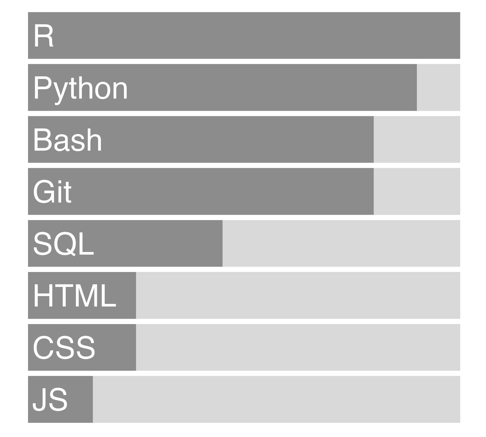

```{r, include=FALSE}
knitr::opts_chunk$set(
  results = 'asis', 
  echo = FALSE,
  fig = TRUE, fig.show = TRUE
)
library(tidyverse)
library(tidyr)
library(glue)
library(stringr)

# To do:
# Develop a second version for resume and also develop CV
# Adjust for non-bio version which rewords bio related terms, etc.
# Quantify outcomes for each bullet point under professional experience section

# Set this to true to have links turned into footnotes at the end of the document
PDF_EXPORT <- TRUE

# Holds all the links that were inserted for placement at the end
links <- c()

# setwd("/Users/8yt/Documents/Personal/cv-master/")

source('parsing_functions.R')


# First let's get the data, filtering to only the items tagged as
# Resume items
position_data <- read_csv('resume-positions-computational-biology.csv',show_col_types = FALSE) %>% 
  filter(in_resume)
# %>% 
#   mutate(
#     # Build some custom sections by collapsing others
#     section = case_when(
#       section %in% c('education','research_positions', 'industry_positions','teaching_positions') ~ 'positions',
#       # section %in% c('data_science_writings', 'by_me_press') ~ 'writings',
#       TRUE ~ section
#     )
#   ) 


```


Aside
================================================================================


{width=100%}

Contact {#contact}
--------------------------------------------------------------------------------


- <i class="fa fa-envelope"></i>  alice.e.townsend@gmail.com
- <i class="fa fa-github"></i> github.com/ayeTown
<!-- - <i class="fa fa-instagram"></i> [atownabstract](https://www.instagram.com/atownabstract/?hl=en) -->
<!-- - <i class="fa fa-palette"></i> [check out my art :)](http://www.atownabstract.etsy.com/) -->
- <i class="fa fa-phone"></i> (408) 438-3465


Language Skills {#skills}
--------------------------------------------------------------------------------

{width=100%}


Open Source {#open-source}
--------------------------------------------------------------------------------

All projects available at `github.com/ayeTown/<name>`<br><br>
`MENTOR`: R package for multi-omics data integration <br><br>
`MOANA`: R Shiny application for multi-omics data viz

<br>

Graduate Courses {#graduate-courses}
--------------------------------------------------------------------------------

Data Science \& Computing, Visual Design, Advanced Bioinformatics, Machine Learning, Natural Language Processing, Deep Learning, Statistics

<!-- Modern Biostatistics, Fundamentals of Probability, Statistical Computing, Epidemiologic Methods, Advanced Regression, Survival Analysis, Advanced Probability, Principles of Modern Biostatistics, Statistical Computing -->


<!-- Activities {#activities} -->
<!-- -------------------------------------------------------------------------------- -->

<!-- - <ul style="list-style-type:circle;"> -->
<!--   <!-- - <li>Leader of Social and Community Committee, Belmont University, 2018-2019</li> -->
<!--   <!-- - <li>Professional Mathematics Tutor</li> -->
<!--   <!-- - <li>Treasurer of Belmont Mathematical Association, 2013-2014</li> -->
<!--   - <li>Nashville Rock 'n Roll Marathon, 2014</li> -->
<!--   - <li>Summited Mt. Whitney, 2010</li> -->
<!--   - <li>Chelsea Football Club Fan since 1992</li> -->
<!-- - </ul> -->


<!-- More info {#more-info} -->
<!-- -------------------------------------------------------------------------------- -->

<!-- Full CV at <i class="fa fa-link"></i> [ayetownsend.com](http://www.ayetownsend.com/) for more complete list of positions. -->


Disclaimer {#disclaimer}
--------------------------------------------------------------------------------

Made w/ [**pagedown**](https://github.com/rstudio/pagedown). 

Last updated on `r Sys.Date()`.


Main
================================================================================

Alice Townsend {#title}
--------------------------------------------------------------------------------

```{r}
intro_text <- "Computational biologist with expertise in multi-omics data integration, network biology, and single-nuclei transcriptomics, with a strong background applying these approaches to biomedical research. Experienced in developing computational methods, performing statistical analyses, and visualizing complex biological datasets using R and Python. Skilled in analyzing large-scale biological datasets on high-performance computing systems. Interested in roles involving computational biology, bioinformatics, data science, software development, and data visualization."

cat(sanitize_links(intro_text))
```


Professional Experience {data-icon=suitcase}
--------------------------------------------------------------------------------

```{r}
position_data %>% print_section('industry_positions')
```


Skills {data-icon=laptop}
--------------------------------------------------------------------------------
```{r}
position_data %>% print_section('skills')
```

Education {data-icon=graduation-cap data-concise=true}
--------------------------------------------------------------------------------

```{r}
position_data %>% print_section('education')
```


<!-- Publications {data-icon=book} -->
<!-- -------------------------------------------------------------------------------- -->

<!-- ```{r} -->
<!-- position_data %>% print_section('academic_articles') -->
<!-- ``` -->


<!-- Teaching Experience {data-icon=chalkboard-teacher} -->
<!-- -------------------------------------------------------------------------------- -->

<!-- ```{r} -->
<!-- position_data %>% print_section('teaching_positions') -->
<!-- ``` -->


<!-- Awards {data-icon=award} -->
<!-- -------------------------------------------------------------------------------- -->

<!-- ```{r} -->
<!-- position_data %>% print_section('awards') -->
<!-- ``` -->


<!-- Research Experience {data-icon=laptop} -->
<!-- -------------------------------------------------------------------------------- -->

<!-- ```{r} -->
<!-- position_data %>% print_section('research_positions') -->
<!-- ``` -->

<!-- Activities {data-icon=award} -->
<!-- -------------------------------------------------------------------------------- -->

<!-- ```{r} -->
<!-- position_data %>% print_section('awards') -->
<!-- ``` -->


